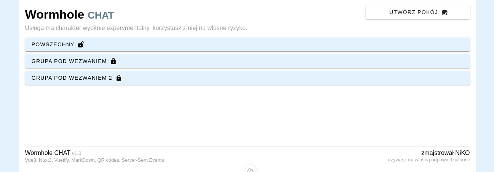
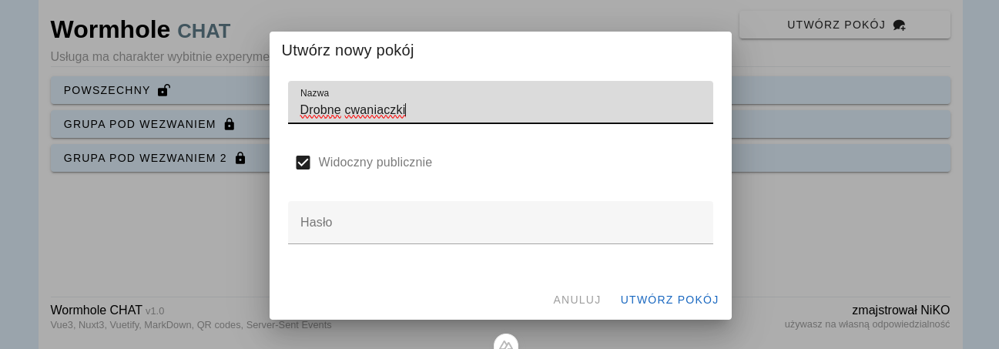
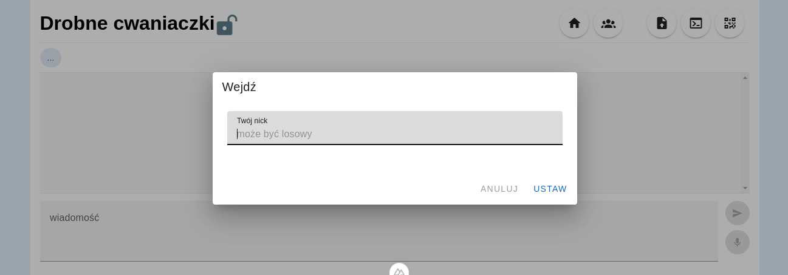
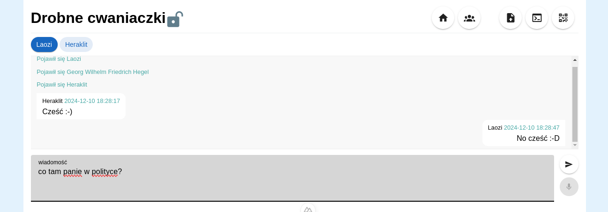
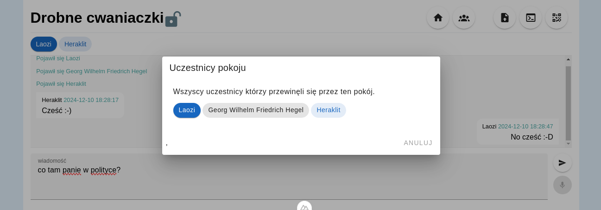
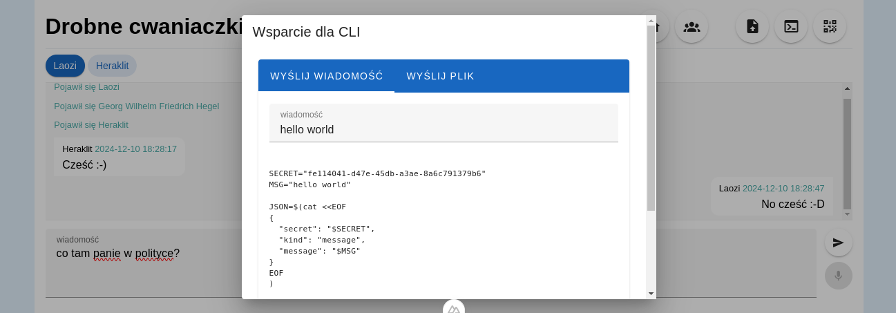
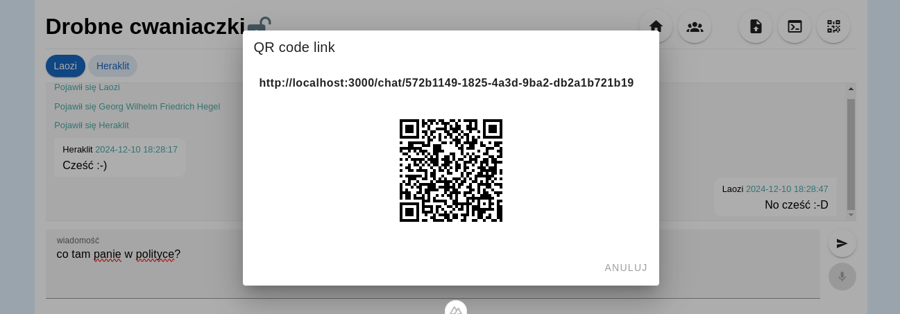

# Wormhole chat

Prosta aplikacja webowa na bazie **Nuxt 3** (Vue 3),
**Vuetify** ze wsparciem między innymi dla **MarkDown**,
**QR codes** i **Server-Sent Events** (SSE),
którą można zbudować do obrazu **Docker**'owego.
Pozwala przesyłać proste teksty i małe pliki.

Nie ma wsparcia dla bazy danych ze wszystkimi tego konsekwencjami.

**DockerHub**: https://hub.docker.com/repository/docker/doleczekj/wormhole-chat/general









## Skrócona obsługa Nuxt3

Look at the [Nuxt documentation](https://nuxt.com/docs/getting-started/introduction) to learn more.

## Setup

```bash
# npm
npm i
```

## Development Server

Start the development server on `http://localhost:3000`:

```bash
# npm
npm run dev
```

## Production

Build the application for production:

```bash
# npm
npm run build
```

Locally preview production build:

```bash
# npm
npm run preview
```

## Build

```bash
docker build --no-cache .
```
